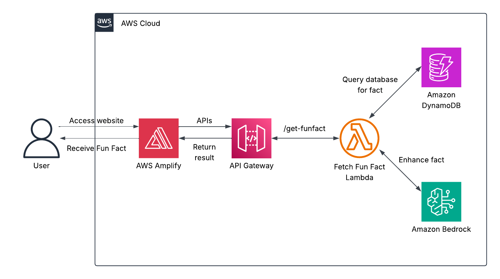
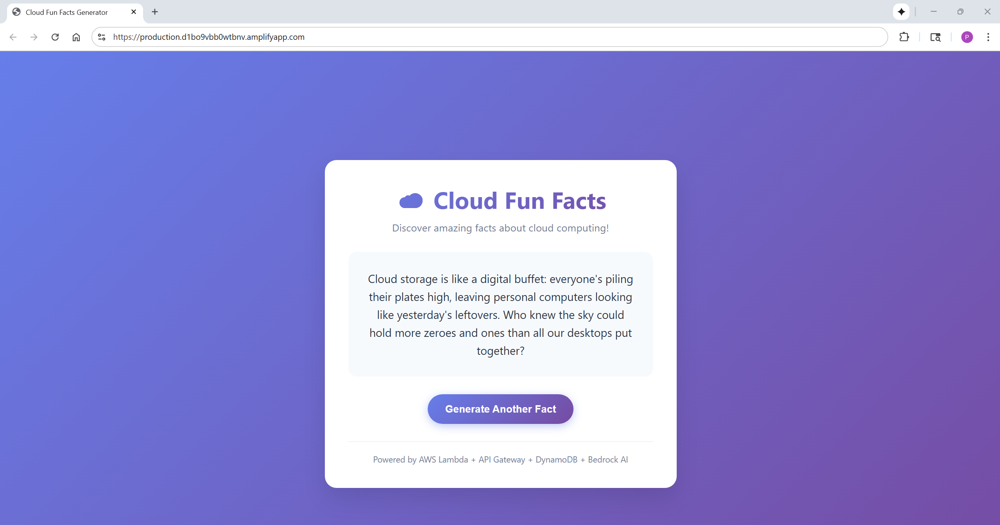

# AWS Cloud Fun Facts Generator
A serverless, event-driven web app that serves random cloud-computing facts. A **Python** AWS **Lambda** behind **Amazon API Gateway (HTTP API)** fetches a random item from **Amazon DynamoDB** and (when permitted by on-demand quotas) enhances it via **Amazon Bedrock – Anthropic Claude 3.5 Sonnet** for a short, witty rewrite. A static **Amplify Hosting** front-end calls the API and renders the result.  

## Architecture Overview
  
*Figure 1: Architecture diagram of the Cloud Fun Facts Generator Application.*  

- **Amazon API Gateway (HTTP API)** – Fronts the backend with a public `GET /funfact` route; CORS restricted to the **Amplify** domain after the second deploy.  
- **AWS Lambda (Python 3.13)** – Serverless function that reads a random fact and optionally calls **Bedrock** for a witty version.  
- **Amazon DynamoDB** – `CloudFacts` table stores source facts as simple `{ FactID, FactText }` items.  
- **Amazon Bedrock (Claude 3.5 Sonnet)** – Generates a short, witty variant of the fact; app falls back to the raw fact if throttled.  
- **AWS Amplify Hosting** – Serves the static front-end (HTML/CSS/JS) that calls the API.  
- **AWS IAM** – Applies least-privilege access: **Lambda** basic execution, **DynamoDB** read-only, **Bedrock** `InvokeModel`.  
- **Amazon CloudWatch Logs** – Captures function logs and Bedrock throttling messages.  

## Skills Applied
- Designing and deploying an **HTTP API** with **Lambda proxy integration**.  
- Implementing **Infrastructure as Code** using **AWS SAM**.  
- Configuring **CORS** to allow only the **Amplify** origin after initial deployment.  
- Applying **least-privilege IAM** for **DynamoDB read** and **Bedrock InvokeModel**.  
- Packaging and running a **Python 3.13 Lambda** with environment-driven configuration.  
- Seeding **DynamoDB** via **AWS CLI batch-write** for reproducible data setup.  
- Handling **Bedrock throttling** gracefully with a **fallback** to the raw fact.  
- Monitoring and troubleshooting with **CloudWatch Logs** and structured responses.  

## Features
- **Backend API** – Public `GET /funfact` endpoint that returns JSON with either a witty or raw fact.  
- **Data Layer** – DynamoDB table (`CloudFacts`) for `fast, serv`erless storage of facts.  
- **GenAI Enhancement** – Optional witty rewrite via Amazon Bedrock (Claude 3.5 Sonnet).  
- **Secure CORS** – API Gateway CORS restricted to the Amplify domain after redeploy.  
- **Static Front-End** – Lightweight Amplify Hosting site with a single button (“Generate Fun Fact”).  

## Tech Stack
- **Languages:** Python 3.13, HTML, JavaScript  
- **AWS Services:** API Gateway (HTTP API), Lambda, DynamoDB, Amazon Bedrock (Anthropic Claude 3.5 Sonnet), Amplify Hosting, IAM, CloudWatch Logs  
- **IaC Tool:** AWS SAM  
- **Other Tools:** AWS CLI, CloudWatch Logs 

## Deployment Instructions
> **Note:** All command-line examples use `bash` syntax highlighting to maximize compatibility and readability. If you are using PowerShell or Command Prompt on Windows, the commands remain the same but prompt styles may differ.  

1. Clone this repository.  

2. Request Model Access in Amazon Bedrock for Anthropic Claude 3.5 Sonnet (and any other models you plan to use).  

### **SAM**
3. Navigate to the `cloudformation` folder, build, and deploy:  
   ```bash
   cd cloudformation
   sam build
   sam deploy --guided --capabilities CAPABILITY_NAMED_IAM
   ```
4. When prompted, provide parameters (e.g., BedrockModelId) or accept defaults.  

5. Seed DynamoDB (`CloudFacts`) with your records:  
   ```bash
   aws dynamodb batch-write-item --region <YOUR_REGION> --request-items file://../src/records/records.json
   ```

6. *(Optional)* Test the Lambda function in the console using an empty test event `{}`.  

7. Wire the front-end: Edit `../src/index.html`, set `API_URL` to the `FunFactsEndpoint` output from SAM, and then zip it.  

8. Deploy front-end on Amplify (Console):  
   Start a manual deployment -> App name: `cloud-fun-facts-generator`, Branch: `production`, Method: Drag and drop -> upload `index.zip` -> Save and deploy.  

9. *(Optional)* Lock down CORS: redeploy SAM and set `AmplifyDomain` to your Amplify URL (e.g., https://production.d1bo9vbb0wtbnv.amplifyapp.com). You can also adjust CORS later in the console: **API Gateway → APIs → FunfactsAPI → CORS**.
  
**Note:** Ensure the AWS CLI is configured (aws configure) with credentials that have sufficient permissions to manage **Lambda**, **DynamoDB**, **API Gateway**, **AWS Bedrock**, and **IAM resources**.  

## How to Use
1. **Deploy the infrastructure** using SAM, upload values to the DynamoDB table, and create the application frontend with AWS Amplify.  

2. **Access the application** by navigating to the Amplify application URL in a browser.  

3. Click **Generate Fun Fact** to generate a fun fact. Click **Generate Another Fact** for another fun fact. **Note:** On on-demand quotas, **Claude 3.5 Sonnet** may allow roughly one witty call per minute. When throttled, the API gracefully falls back to returning a raw fact from **DynamoDB**.    

## Project Structure
```plaintext
aws-cloud-fun-facts-generator
├── assets/                          	  # Images, diagrams, screenshots
│   ├── architecture-diagram.png          # Project architecture diagram
│   └── application-screenshot.png        # Application screenshot
├── cloudformation/                       # AWS SAM template
│   └── template.yaml                     # Main SAM template
├── src/                              	  # Source code and fun facts
│   └── cloudfunfacts_function/           # Cloud Fun Facts Lambda
│       └── cloudfunfacts_lambda.py
│   └── records/              			  # DynamoDB seed values
│       └── records.json
│   └── index.html			              # Default web page
├── LICENSE
├── README.md
└── .gitignore
```

## Screenshot
  

*Figure 2: Cloud Fun Facts Generator Application UI.*  

## Future Enhancements
- **DynamoDB caching** – Store a `WittyText` per fact (with optional **TTL**) to reduce Bedrock calls.  
- **Retry & backoff** – Add client/server **exponential backoff** for transient throttling.  
- **Model/profile options** – Explore **inference profiles** or alternative models for higher throughput.  
- **Auth & rate limiting** – Add **Cognito/JWT** or **API keys** + **Usage Plans**, and optionally **AWS WAF**.  
- **Observability** – Add **X-Ray tracing**, **CloudWatch Dashboards**, and structured logs/metrics.  
- **CI/CD** – Automate builds with **GitHub Actions** or **CodePipeline** for both backend and site.  

## License
This project is licensed under the [MIT License](LICENSE).  

---

## Author
**Patrick Heese**  
Cloud Administrator | Aspiring Cloud Engineer/Architect  
[LinkedIn Profile](https://www.linkedin.com/in/patrick-heese/) | [GitHub Profile](https://github.com/patrick-heese)

## Acknowledgments
This project was inspired by a course from [techwithlucy](https://github.com/techwithlucy).  
The Lambda function and HTML are adapted directly from the author's original implementation (environment variables added for portability).  
The architecture diagram included here is my own version, adapted from the original course diagram.  
I designed and developed all Infrastructure-as-Code (SAM) and project documentation.  
